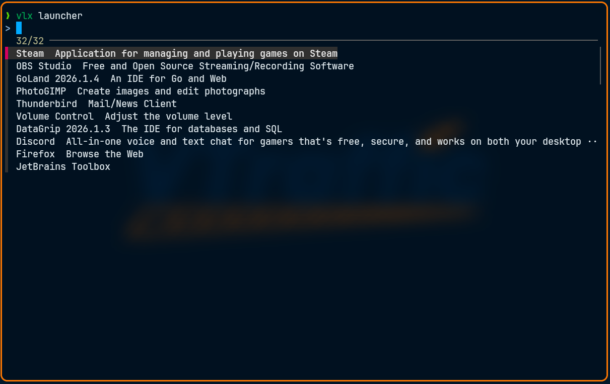
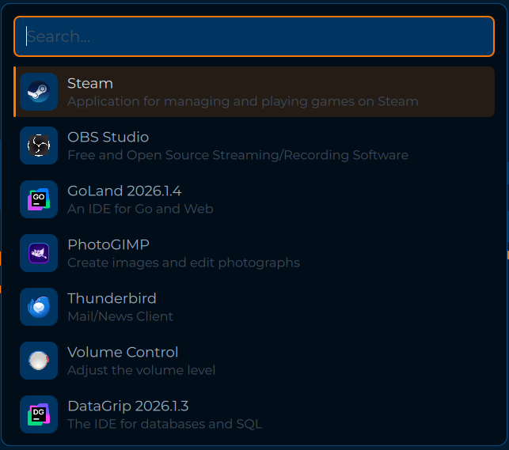
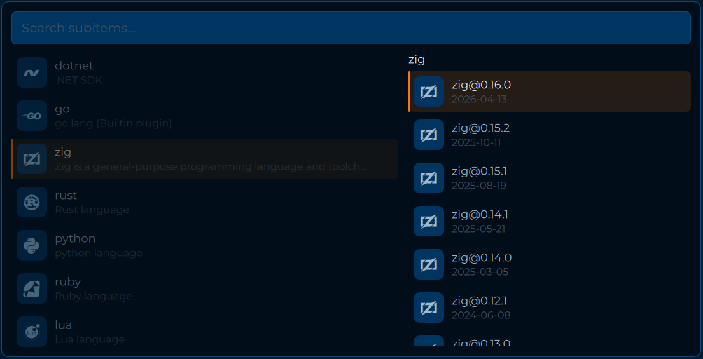
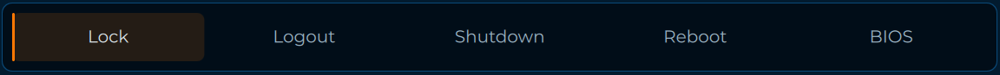

# How does the picker stuff work?
There are the following actors in a picking process:
- Sway (the wm)
- Quickshell (the main ui)
- Terminal (the secondary ui)
- vlx (the management app)

You can initiate a picking process either through an interactive terminal session or through a binding that you execute directly with your window manager. Either way, the data that is necessary for selection flows through `vlx` and then gets piped back out to the source of ingestion through the `Picker` abstraction.

If you initiated the command through your terminal, a simple `fzf` selection is shown in that same instance.

If you initiated the command through other means (most likely a Wayland WM), the data is redirected to a quickshell QML template file.

There are other picker options that include a two staged selection which is either a sequential select with `fzf` but comes with its own picker in the quickshell version.

## What can I pick?
There is no technical limitation on what the picker can/cannot serve. However its design is based on a few requirements to make it blend in well.
- Icon (SVG)
- Header
- Small (!) description

There is the exception of the `PowerPicker.qml` which uses hardcoded commands to either logout, shutdown etc.

