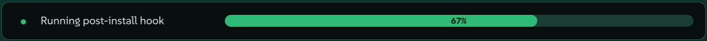
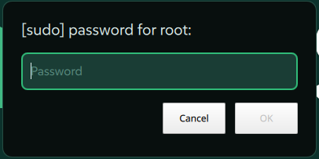

# Visuals
There are two ways to interact with `vlx` as a user. These are either through an interactive terminal or through a non-interactive process like the window manager (but also scripting for example). When it comes to processes that are meant to provide an interaction or information to the user this distinction is crucial and decides which of the methods below gets chosen. 

## Picker
You can initiate a picking process either through an interactive terminal session or through a binding that you execute directly with your window manager. Either way, the data that is necessary for selection flows through `vlx` and then gets piped back out to the source of ingestion through the `Picker` abstraction.

If you initiated the command through your terminal, a simple `fzf` selection is shown in that same instance.

If you initiated the command through other means (most likely a Wayland WM), the data is redirected to a quickshell QML template file.

There are other picker options that include a two-stage selection which is a sequential select with `fzf` in the terminal but comes with its own picker in the quickshell version.

### What can I pick?
There is no technical limitation on what the picker can/cannot serve. However its design is based on a few requirements to make it blend in well.
- Icon (SVG)
- Header
- Small (!) description

There is the exception of the `PowerPicker.qml` which uses hardcoded commands to either logout, shutdown etc.

## Progress
Some actions that `vlx` invokes are considered long-running tasks (e.g., installation of a bundle). In addition to notifications that inform the user about errors, the `Progress` abstraction allows monitoring the current state of those operations. In a terminal session this does not add much value. If you however instantiate such a long-running operation through the window manager for example this popup is shown.

If the operation needs elevated access this will either be prompted for directly in the terminal or the user will be asked to enter their password in another quickshell popup like the one below.

.